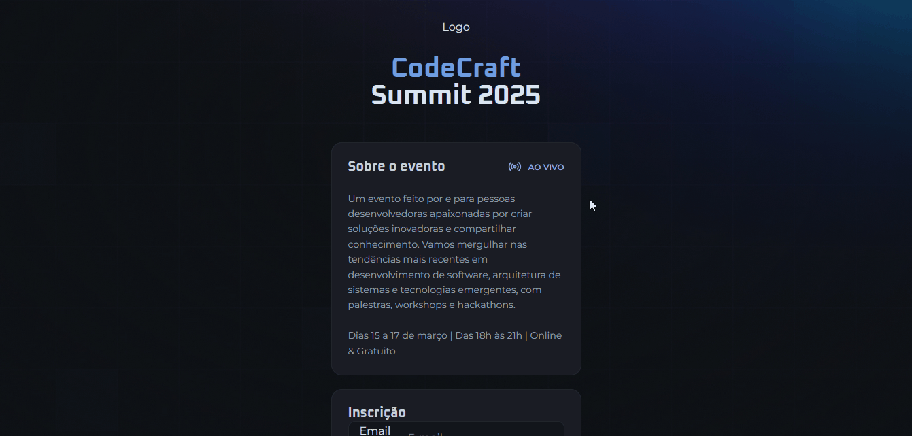
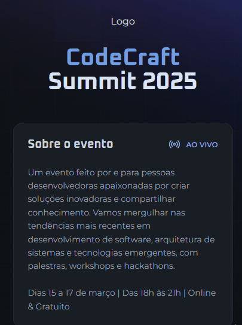

<h1 align="center">NLW Connect</h1>

  Projeto da Rocketseat para aprender o mundo da programação.

 

## 🚀 Tecnologias

Esse projeto foi desenvolvido com as seguintes tecnologias:

- HTML, CSS e JS
- Git Github

## 💻 Projeto

Nesse projeto fiz um formulário sobre o CodeCraft Summit 2025.

## Como ficou o projeto online

  

## 📱 Mobile

  

  
<a href="https://nlw-connect-gamma.vercel.app/" target="_blank">Clique para</a> acessar o link</a>
  

## Conclusão

O foco do projeto foi já meter a mão na massa em JavaScript para aprender os conceitos de lógica.
Didática rápida e segura.